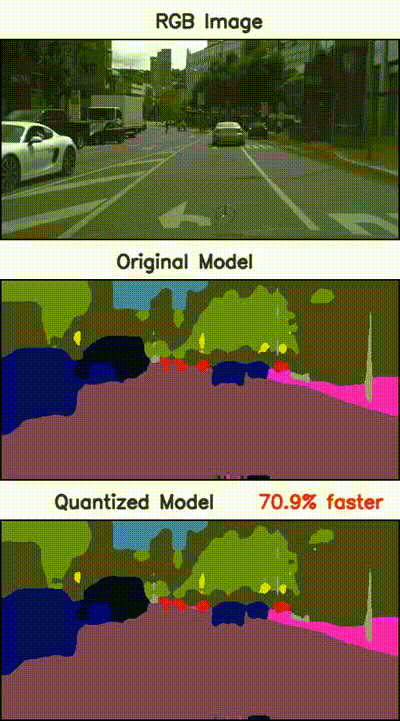
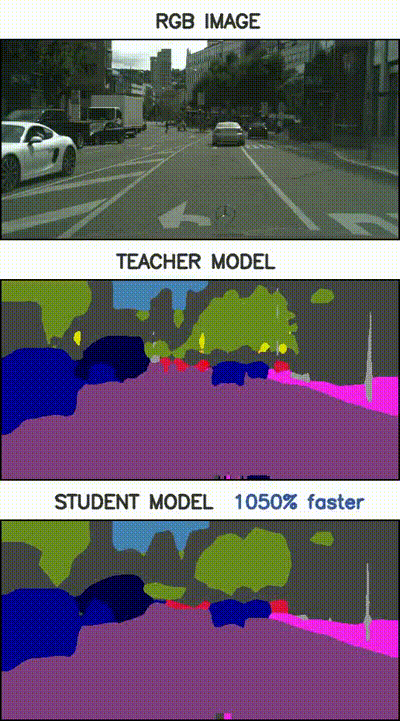

# Model Optimization for Segmentation 
The aim of this project was to a take a scene segmentation model (DeepLabV3) used in a self-driving car and optimize it using Quantization and Knowledge Distillation techniques.

## Dependencies 
1. thop : PyTorch OpCounter
2. pytorch 

## Project Structure
- ```outputs``` contain output videos
- ```scripts```/```models``` contains the model architecture used for inference
- ```scipts``` contains the helper files for reading the dataset, tabulating metrics for inference and model performance
- ```main``` contains the notebooks for quantization and knowledge distillation

## Output
 

